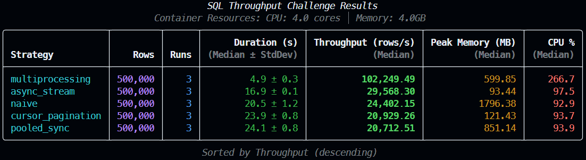
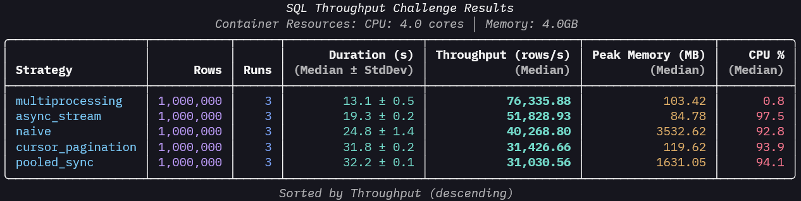

# SQL Throughput Challenge

> **A reproducible benchmark lab for PostgreSQL bulk-read architecture in Python.**


It compares five execution strategies under fixed CPU/RAM constraints and reports throughput, peak memory, and CPU behavior across 100K, 500K, and 1M row workloads.

| Strategy | One-liner |
| --- | --- |
| **Naive** | `fetchall()` baseline to expose Python-side memory saturation. |
| **Cursor Pagination** | Server-side cursor streaming to enforce near-constant client memory. |
| **Pooled Sync** | `psycopg_pool` checkout model for batched sync reads under connection reuse. |
| **Async Stream** | `asyncpg` cursor fan-out with bounded concurrency for non-blocking I/O pipelines. |
| **Multiprocessing** | Multi-process ID-partitioned fan-out to bypass the GIL and scale row decode throughput. |

## Benchmark Proof

Benchmarks were executed with 3 runs per strategy (median shown), containerized resource limits, and persisted artifacts in `results/`.

| Strategy | 100K rows/s | 500K rows/s | 1M rows/s | 1M peak RSS (MB) |
| --- | ---: | ---: | ---: | ---: |
| **Multiprocessing** | 39,370 | 102,249 | 124,378 | 777 |
| **Async Stream** | 28,089 | 29,568 | 28,901 | 101 |
| **Naive** | 25,510 | 24,402 | 23,359 | 3,537 |
| **Pooled Sync** | 20,450 | 20,713 | 20,576 | 1,644 |
| **Cursor Pagination** | 21,413 | 20,929 | 19,520 | 126 |

- **Throughput proof:** Multiprocessing reaches **124,378 rows/s** at 1M rows, about **5.3x** the naive baseline.
- **Memory proof:** Async Stream holds 1M-row peak memory at **~101 MB**, about **97% lower** than naive (`~3,537 MB`).
- **Scaling proof:** Naive throughput remains nearly flat from 100K to 1M while memory grows roughly 9x, confirming a memory-bound architecture.

### Visual Evidence





### Metric Artifact Excerpt

```json
{
  "limit": 1000000,
  "strategy": "multiprocessing",
  "throughput_rows_per_sec": { "median": 124378.11 },
  "peak_rss_bytes": { "median": 815017984 }
}
```

Source: `results/run-20260207T002833Z.json`

## Problem Statement

In Python backend development, choosing between `sync`, `async`, or `multiprocessing` for bulk-read operations is often driven by "vibe" or trends rather than empirical data. When engineering teams can’t quantify where a strategy fails, the result is:

- **Unpredictable OOM Incidents:** Hidden memory spikes in ETL jobs that crash production containers.
- **SLA Breaches:** Latency degradation that only appears under specific "workload shapes."
- **Wasted Cloud Spend:** Over-provisioning resources because the execution bottleneck (CPU vs. I/O) isn't truly understood.

**This project replaces anecdote with evidence.** It provides a standardized framework to profile and justify architectural choices based on measured memory RSS, throughput, and latency across diverse operating envelopes.


## Technical Decisions

The strategy portfolio intentionally spans a full decision surface: baseline (`naive`), memory-safe serial stream (`cursor_pagination`), pool-managed sync (`pooled_sync`), event-loop concurrency (`async_stream`), and CPU-parallel fan-out (`multiprocessing`). This was selected to separate bottlenecks rather than mask them. For example, cursor streaming improves consistency and memory predictability by holding a transaction and consuming deterministic batches, but that same choice trades off latency under high demand because work remains serialized on one Python process. In contrast, multiprocessing improves latency and raw throughput by parallelizing decode work across processes, but pays for that gain in higher aggregate RSS and orchestration overhead. The design goal is not to crown a universal winner; it is to map which architecture is dominant for each workload and operational constraint.

The project is deliberately SQL-first instead of adding NoSQL paths because the target problem is relational analytical reads with ordering guarantees and transactional semantics. SQL provides deterministic row selection (`ORDER BY id`, bounded `LIMIT`, transactional cursor scope) that makes cross-run comparisons valid, while equivalent NoSQL scans would introduce different consistency and index trade spaces that dilute the benchmark question. Within SQL, driver choices are similarly intentional: `asyncpg` is used for async streaming due to protocol efficiency, while `psycopg3` + `psycopg_pool` covers synchronous and pooled control paths.

Python/backend best practices are built into execution quality: strict static typing (`mypy` with `disallow_untyped_defs`), validated settings via Pydantic, safe process start mode (`spawn`) for cross-platform isolation, explicit timeout controls (`DB_STATEMENT_TIMEOUT_MS`), run-level failure policies (tolerant vs strict), and profiler-based peak RSS/CPU measurement with background sampling to capture transient spikes.

## Reproduce Evidence

```bash
make benchmark ROWS=100000 RUNS=3
make benchmark ROWS=500000 RUNS=3
make benchmark ROWS=1000000 RUNS=3
```

Detailed methodology: [docs/methodology.md](docs/methodology.md)
